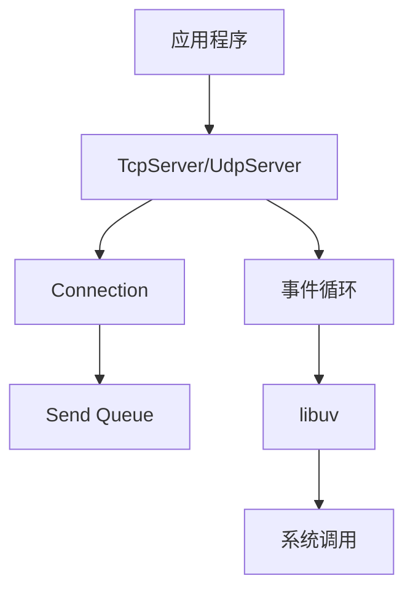

# libuv_server

一个基于libuv的高性能网络库，提供简洁易用的TCP和UDP服务器接口。

## 项目原理

### 核心设计
libuv_server基于libuv的事件驱动模型构建，主要包含以下核心组件：

1. **事件循环**：使用libuv的事件循环处理网络I/O、定时器、异步操作等
2. **连接管理**：封装TCP和UDP连接，提供统一的连接接口
3. **发送缓冲**：TCP连接内置发送队列，支持高频发送操作
4. **连接ID分配**：为每个TCP/WebSocket连接分配唯一的连接ID，方便日志追踪和调试
5. **优雅退出**：支持USR1信号触发的优雅退出，确保资源正确释放

### 架构图



## 核心接口

### Connection 抽象类
所有连接的基类，提供统一的接口：

```cpp
class Connection {
public:
    virtual void Send(const char* data, size_t len) = 0;  // 发送数据
    virtual void Close() = 0;                            // 关闭连接
    virtual std::string GetIP() = 0;                     // 获取客户端IP
    virtual int GetPort() = 0;                           // 获取客户端端口
    virtual uint32_t GetConnId() = 0;                    // 获取连接ID
};
```

### TcpServer 类
TCP服务器实现：

```cpp
class TcpServer : public Server {
public:
    TcpServer(uv_loop_t* loop, const ServerConfig& config = ServerConfig());  // 构造函数
    
    void SetOnOpen(CallbackOpen cb);                     // 设置连接打开回调
    void SetOnMessage(CallbackMessage cb);               // 设置消息回调
    void SetOnClose(CallbackClose cb);                   // 设置连接关闭回调
    
    bool Start(const std::string& ip, int port);  // 启动服务器
    
    // 配置管理
    void SetConfig(const ServerConfig& config);
    const ServerConfig& GetConfig() const;
    
    // 缓冲区配置
    void SetReadBufferSize(size_t size);
    void SetMaxSendQueueSize(size_t size);
    
    // 连接池管理
    void SetMaxConnections(size_t max);
    void SetHeartbeatInterval(int64_t interval_ms);
    
    // 连接读超时设置
    void SetConnectionReadTimeout(int64_t timeout_ms);
};
```

### UdpServer 类
UDP服务器实现：

```cpp
class UdpServer : public Server {
public:
    UdpServer(uv_loop_t* loop = uv_default_loop(), const ServerConfig& config = ServerConfig());  // 构造函数
    
    void SetOnOpen(CallbackOpen cb);                     // 设置连接打开回调
    void SetOnMessage(CallbackMessage cb);               // 设置消息回调
    void SetOnClose(CallbackClose cb);                   // 设置连接关闭回调
    
    bool Start(const std::string& ip, int port);  // 启动服务器
    
    // 缓冲区配置
    void SetReadBufferSize(size_t size);
    void SetMaxSendQueueSize(size_t size);
    
    // 连接池管理
    void SetMaxConnections(size_t max);
    void SetHeartbeatInterval(int64_t interval_ms);
    
    // 连接超时管理
    void SetConnectionReadTimeout(int64_t timeout_ms);
};
```

### WebSocketServer 类
WebSocket服务器实现：

```cpp
class WebSocketServer : public Server {
public:
    WebSocketServer(uv_loop_t* loop, const ServerConfig& config = ServerConfig());  // 构造函数
    
    void SetOnOpen(CallbackOpen cb);                     // 设置连接打开回调
    void SetOnMessage(CallbackMessage cb);               // 设置消息回调
    void SetOnClose(CallbackClose cb);                   // 设置连接关闭回调
    
    bool Start(const std::string& ip, int port);  // 启动服务器
    
    // 缓冲区配置
    void SetReadBufferSize(size_t size);
    void SetMaxSendQueueSize(size_t size);
    
    // 连接池管理
    void SetMaxConnections(size_t max);
    void SetHeartbeatInterval(int64_t interval_ms);
    
    // 连接超时管理
    void SetConnectionReadTimeout(int64_t timeout_ms);
};
```

## 使用示例

### TCP Echo Server

```cpp
#include "uv_net.h"
#include <iostream>

using namespace uv_net;

int main() {
    // 创建事件循环和服务器
    uv_loop_t* loop = uv_default_loop();
    TcpServer server(loop);
    
    // 设置连接打开回调
    server.SetOnOpen([](std::shared_ptr<Connection> conn) {
        std::cout << "客户端连接: " << conn->GetIP() << ":" << conn->GetPort() << std::endl;
        conn->Send("欢迎连接到服务器！\n", 22);
    });
    
    // 设置消息回调
    server.SetOnMessage([](std::shared_ptr<Connection> conn, const char* data, size_t len) {
        std::string msg(data, len);
        std::cout << "收到消息: " << msg;
        // 回显消息
        conn->Send(data, len);
    });
    
    // 设置连接关闭回调
    server.SetOnClose([](std::shared_ptr<Connection> conn) {
        std::cout << "客户端断开: " << conn->GetIP() << std::endl;
    });
    
    // 启动服务器
    if (!server.Start("0.0.0.0", 7000)) {
        std::cerr << "启动服务器失败！" << std::endl;
        return 1;
    }
    
    std::cout << "服务器启动成功，监听端口7000" << std::endl;
    uv_run(loop, UV_RUN_DEFAULT);
    
    return 0;
}
```

### UDP Echo Server

```cpp
#include "uv_net.h"
#include <iostream>

using namespace uv_net;

int main() {
    // 创建UDP服务器
    UdpServer server;
    
    // 设置消息回调
    server.SetOnMessage([](std::shared_ptr<Connection> conn, const char* data, size_t len) {
        std::string msg(data, len);
        std::cout << "UDP消息: " << conn->GetIP() << ":" << conn->GetPort() << " -> " << msg;
        // 回显消息
        conn->Send(data, len);
    });
    
    // 启动服务器
    if (!server.Start("0.0.0.0", 7001)) {
        std::cerr << "启动UDP服务器失败！" << std::endl;
        return 1;
    }
    
    std::cout << "UDP服务器启动成功，监听端口7001" << std::endl;
    
    // 运行事件循环
    uv_run(uv_default_loop(), UV_RUN_DEFAULT);
    
    return 0;
}
```

## 构建说明

### 依赖要求
- CMake 3.10+
- libuv 1.50+
- OpenSSL 1.1.1+ (用于WebSocket握手的SHA-1计算)
- C++14兼容的编译器

### 构建步骤

1. **安装依赖**
   ```bash
   # Ubuntu/Debian
   sudo apt-get install cmake libuv1-dev libssl-dev
   
   # CentOS/RHEL
   sudo yum install cmake libuv-devel openssl-devel
   
   # macOS
   brew install cmake libuv openssl
   ```

2. **构建项目**
   ```bash
   mkdir -p build
   cd build
   cmake ..
   make
   ```

3. **运行示例**
   ```bash
   ./echo_server
   ```

## 特性

- ✅ 高性能事件驱动模型
- ✅ TCP、UDP和WebSocket服务器支持
- ✅ 内置发送缓冲队列
- ✅ 统一的连接接口
- ✅ 简洁易用的API
- ✅ 跨平台支持
- ✅ 连接ID分配与追踪
- ✅ USR1信号优雅退出支持

## 测试

### 测试TCP功能
```bash
# 使用telnet测试TCP回显
$ telnet localhost 7000
Trying 127.0.0.1...
Connected to localhost.
Escape character is '^]'.
Welcome! Type something.
Hello
Hello
```

### 优雅退出测试
```bash
# 启动服务器
$ ./echo_server

# 另开一个终端，获取服务器进程ID
$ ps aux | grep echo_server

# 发送USR1信号触发优雅退出
$ kill -USR1 <server_pid>

# 服务器会输出以下日志并退出
Received SIGUSR1 signal, exiting gracefully...
UDP Server destroying
UDP Server destroyed
WebSocket Server destroying
WebSocket Server destroyed
TCP Server destroying
TCP Server destroyed
```

### 测试UDP功能
```bash
# 使用nc测试UDP回显
$ echo "Hello UDP" | nc -u localhost 7001
Hello UDP
```

### 测试WebSocket功能

1. **使用curl测试握手**
```bash
# 测试WebSocket握手
$ curl -v --include --header "Connection: Upgrade" --header "Upgrade: websocket" --header "Host: localhost:8080" --header "Origin: http://localhost:8080" --header "Sec-WebSocket-Key: dGhlIHNhbXBsZSBub25jZQ==" --header "Sec-WebSocket-Version: 13" http://localhost:8080
```

2. **使用wscat测试WebSocket通信**
```bash
# 安装wscat
$ npm install -g wscat

# 连接到WebSocket服务器并发送消息
$ wscat -c ws://localhost:8080
Connected (press CTRL+C to quit)
< Welcome to WebSocket Echo Server!
> Hello WebSocket
< Hello WebSocket
> test
< test
```

3. **使用浏览器测试**
```javascript
// 在浏览器控制台中运行以下代码
const socket = new WebSocket('ws://localhost:8080');

// 连接打开时触发
socket.onopen = function(event) {
    console.log('WebSocket连接已打开');
    socket.send('Hello from browser');
};

// 收到消息时触发
socket.onmessage = function(event) {
    console.log('收到消息:', event.data);
};

// 连接关闭时触发
socket.onclose = function(event) {
    console.log('WebSocket连接已关闭');
};

// 发送消息
// socket.send('Your message here');
```

## 许可证

MIT License
